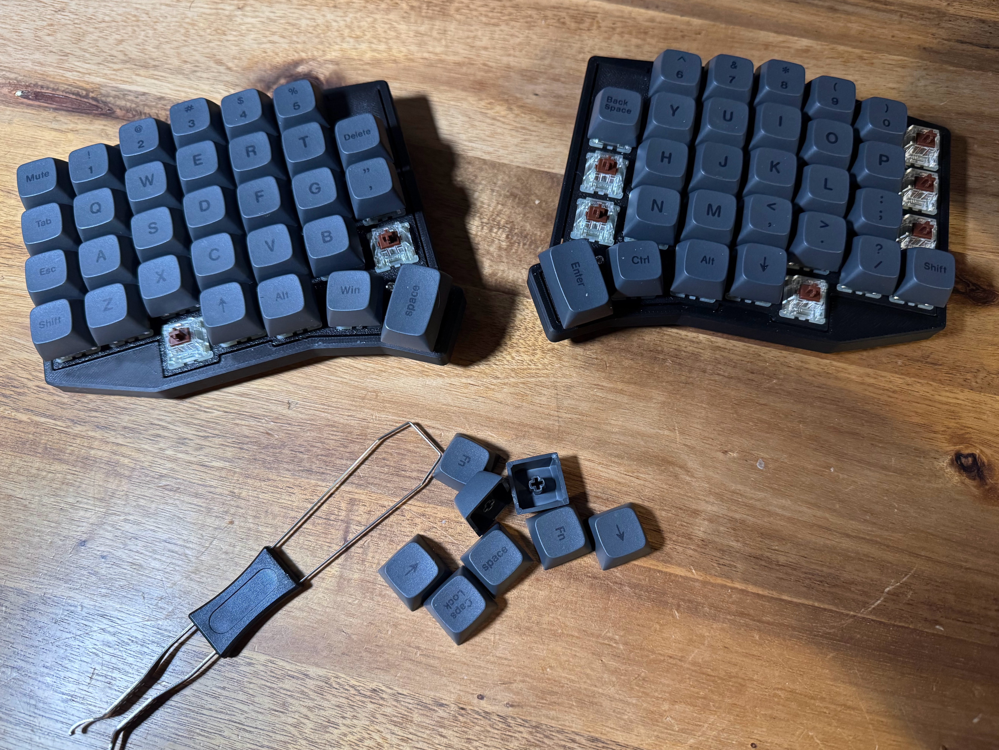

## The Journey to Split Keyboards
I've been using mechanical keyboards for years, but always stuck with traditional 80% layouts. My first attempt at going split was with a Corne keyboard, but it failed after just a few weeks. However, the appeal of better ergonomics and reduced strain during long coding sessions kept drawing me back to split keyboards. Plus, there's something oddly satisfying about completely relearning how to type—because who doesn't enjoy feeling like a complete beginner again?

## What is the Sofle?

The Sofle is an open-source split keyboard design featuring:
- 66 keys total (33 per half)
- Column-staggered layout for natural finger positioning
- Full QMK/VIA support for customization
- Hot-swappable switches

## The Build Process

I soldered a corne some years back with my 20 buck soldering iron and it quickly had some issues so I decided to go with a pre-soldered PCB for the Sofle.

### Components
- Sofle v2 PCB (Everything pre-soldered)
- Mechanical switches (I went with Gateron Browns)
- Keycaps (XDA profiles)
- USB 2.4Ghz dongle for wireless connectivity
- USB-C cable for charging

## Layout and Layers

Since this is the 66 key version which gives an extra 8 keys and 6 of them in range of the index finger, I'll see if I can try to have minimal use of layers for normal day to day coding.

## The Learning Curve

Will get back to this after the first week of using it 100%