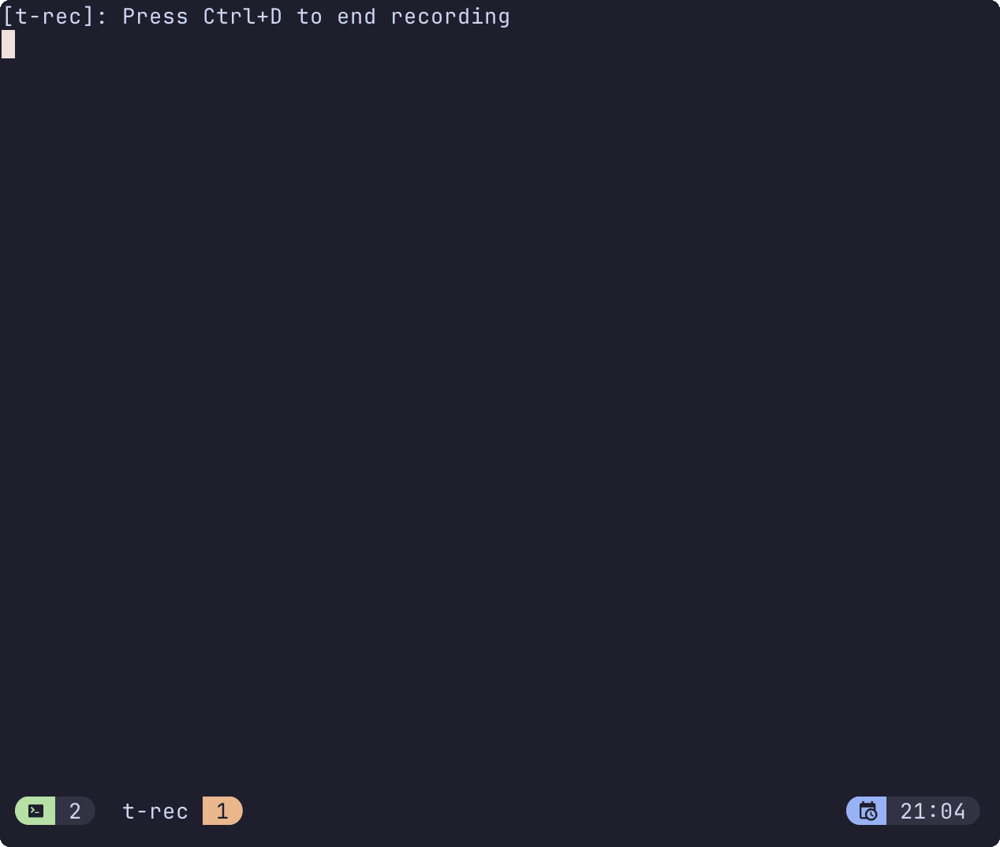

I collect a lot of little snippets and notes that I store in my Obsidian vault for remembering nice tools or helpful actions across my day to day work.

---

## AWS ALB Transform Actions for URL Rewrites

AWS ALB now supports URL rewrites using the **transform action** - no need to rely on redirects or backend rewrites anymore! This is particularly useful for path-based routing scenarios where you want to modify the request before it reaches your backend.

### What can you do?

Transform actions let you modify request headers and paths using pattern matching and variable substitution:

- Rewrite paths (e.g., `/old/path` → `/new/path`)
- Add/modify/remove headers
- Append query strings
- Use pattern matching with wildcards and capture groups

### Example: AWS Load Balancer Controller

Here's how to use transforms with the AWS Load Balancer Controller for Kubernetes:

```yaml
apiVersion: networking.k8s.io/v1
kind: Ingress
metadata:
  name: api-rewrite
  annotations:
    alb.ingress.kubernetes.io/actions.rewrite-api: |
      {
        "Type": "forward",
        "ForwardConfig": {
          "TargetGroups": [{"ServiceName": "api-service", "ServicePort": "80"}]
        },
        "Transform": {
          "Path": {
            "Pattern": "/v1/*",
            "Replacement": "/api/v2/$1"
          }
        }
      }
spec:
  ingressClassName: alb
  rules:
  - http:
      paths:
      - path: /v1
        pathType: Prefix
        backend:
          service:
            name: rewrite-api
            port:
              name: use-annotation
```

In this example:
- Requests to `/v1/users` get rewritten to `/api/v2/users` before reaching the backend
- The `$1` captures everything after `/v1/` and substitutes it into the replacement pattern

### Why is this useful?

- **API versioning**: Handle multiple API versions at the ALB layer
- **Legacy migrations**: Rewrite old paths to new endpoints without changing client code
- **Microservices routing**: Route to services with different path structures
- **Cleaner URLs**: Present user-friendly URLs while using different internal paths

### Learn more

- [AWS ALB Transform Actions docs](https://docs.aws.amazon.com/elasticloadbalancing/latest/application/rule-transforms.html)
- [AWS Load Balancer Controller annotations](https://kubernetes-sigs.github.io/aws-load-balancer-controller/v2.14/guide/ingress/annotations/#transforms)

---

## Random unit conversions

As an SRE, we're often measuring things in unites of time. Eg. billions of requests per month, cost of running x in aws for y time, etc.

### Seconds

| Unit   | Number of Seconds                                   |
|--------|-----------------------------------------------------|
| Minute | 60                                                  |
| Hour   | 3,600 (60 minutes × 60 seconds)                     |
| Day    | 86,400 (24 hours × 60 minutes × 60 seconds)         |
| Week   | 604,800 (7 days × 86,400 seconds)                   |
| Month  | 2,629,746 (30.44 days × 86,400 seconds)             |
| Year   | 31,536,000 (365 days × 86,400 seconds)              |

### Minutes

| Unit      | Number of Minutes                                |
|-----------|--------------------------------------------------|
| Minute    | 1                                                |
| Hour      | 60                                               |
| Day       | 1,440 (24 hours × 60 minutes)                    |
| Week      | 10,080 (7 days × 1,440 minutes)                  |
| Month     | 43,800 (30.44 days × 1,440 minutes)              |
| Year      | 525,600 (365 days × 1,440 minutes)               |

### Hours

| Unit      | Number of Hours                                  |
|-----------|--------------------------------------------------|
| Hour      | 1                                                |
| Day       | 24                                               |
| Week      | 168 (7 days × 24 hours)                          |
| Month     | 730.5 (30.44 days × 24 hours)                    |
| Year      | 8,760 (365 days × 24 hours)                      |


### 1 Billion units per month

| Unit      | Number of Units per Month                        |
|-----------|--------------------------------------------------|
| Per Second| ~380 (1,000,000,000 / 2,629,746 seconds)         |
| Per Minute| ~22,831 (1,000,000,000 / 43,829 minutes)         |
| Per Hour  | ~1,369,863 (1,000,000,000 / 730 hours)           |
| Per Day   | ~32,894,737 (1,000,000,000 / 30.44 days)         |
| Per Week  | ~230,263,158 (1,000,000,000 / 4.35 weeks)        |
| Per Month | 1,000,000,000                                    |
| Per Year  | 12,000,000,000 (1,000,000,000 × 12 months)       |

---

## Creating Terraform IDs based on time.

When creating terraform resources most of the time they should be unique and dynamic, I like to use a time based ID rather than a random string. This way I can easily identify when the resource was created and order them by time if needed. Date string would probs be better but who doesn't like converting hex to decimal and then to date.

This does cause some chicken and egg problems in Terraform sometimes.

```hcl
resource "time_static" "timestamp_id" {}

locals {
  timestamp_id = format(
    "%x", time_static.timestamp_id.unix
  )

  timestamps = {
    unix = local.timestamp_id
    # will give a 9 character hex string after this date
    four_billion_two_hundred_ninetyfour_million_nine_hundred_sixtyseven_thousand_two_hundred_ninety_five = format(
      "%x", 4294967295
    ) # 2106-02-07 06:28:15
  }
}

output "timestamps" {
  value = local.timestamps
}
```

Random calculation to figure out when the 32 bit unix timestamp will overflow:

`4,294,967,296 seconds / (365.25 * 24 * 3600) ≈ 136 years from 1970 = 2106`

---

## Kubernetes Deployment that OOMKilled

This deployment will eventually get OOMKilled as it tries to allocate more memory than the limit set.

```
apiVersion: apps/v1
kind: Deployment
metadata:
  name: oomkill-test-deployment
  labels:
    app: oomkill-test
spec:
  replicas: 1
  selector:
    matchLabels:
      app: oomkill-test
  template:
    metadata:
      labels:
        app: oomkill-test
    spec:
      containers:
      - name: memory-eater
        image: python:3-alpine
        command: ["/bin/sh"]
        args:
          - "-c"
          - |
            python3 -c "
            import time
            import sys

            print('Starting memory allocation test...', flush=True)
            memory_list = []
            chunk_size = 10 * 1024 * 1024  # 10MB

            while True:
                try:
                    # Allocate 10MB of memory
                    memory_chunk = bytearray(chunk_size)
                    memory_list.append(memory_chunk)

                    total_mb = (len(memory_list) * chunk_size) / (1024 * 1024)
                    print(f'Allocated {total_mb:.1f} MB', flush=True)

                    time.sleep(2)
                except MemoryError:
                    print('Memory allocation failed!', flush=True)
                    break
            "
        resources:
          requests:
            memory: "64Mi"
            cpu: "10m"
          limits:
            memory: "128Mi"
            cpu: "100m"
```

---

## fzf and all its glory

I've been using `fzf` for a while now, and it has completely transformed my command line experience. The ability to fuzzy-find files, commands, and even git branches is a game changer. If you haven't tried it yet, I highly recommend giving it a go!



In this demo, I'm using fzf to find git project directory and then creating a new tmux window.

`ctrl + a + f`

ctrl + a is my tmux prefix

tmux config

`bind-key -r f display-popup -E "zsh $HOME/.local/scripts/tmux-project.sh"`

```shell
───────┬──────────────────────────────────────────────────────────────────
       │ File: .local/scripts/tmux-project.sh
───────┼──────────────────────────────────────────────────────────────────
   1   │ #!/usr/bin/env zsh
   2   │
   3   │ selected_dir=$(cd ~/dev; fd -t d -d 2 . --color=always | fzf --an
       │ si --highlight-line -e)
   4   │ if [[ -n "$selected_dir" ]]; then
   5   │     dir_basename=$(basename "$selected_dir")
   6   │     tmux new-window -a -n "${dir_basename:0:6}" -c "$HOME/dev/$se
       │ lected_dir" -k
   7   │ else
   8   │     echo "No directory selected"
   9   │ fi
───────┴──────────────────────────────────────────────────────────────────
```

---

## ArgoCD multi source applications

I was creating some basic app deployments in ArgoCD and was using a multi source app to pass in values to a Helm chart. Little did I know, that any Kubernetes resource in the path of the ref source will actually also be included in the rendered template.

```yaml
# yaml-language-server: $schema=https://raw.githubusercontent.com/datreeio/CRDs-catalog/refs/heads/main/argoproj.io/applicationset_v1alpha1.json
apiVersion: argoproj.io/v1alpha1
kind: ApplicationSet
metadata:
  name: external-dns
  namespace: argocd
  labels:
    team: platform
spec:
  ...
  template:
    ...
    spec:
      project: cluster-tools
      sources:
      - repoURL: https://kubernetes-sigs.github.io/external-dns/
        chart: external-dns
        targetRevision: 1.18.0
        helm:
          releaseName: external-dns
          namespace: external-dns
          valueFiles:
          - $values/values.yaml
      - repoURL: https://github.com/foo/bar.git
        targetRevision: HEAD
        path: baz/bar/foo # Any Kubernetes resources in this directory will also be rendered even though ref is defined.
        ref: values
```

Being able to essentially put any supporting resource in the `baz/bar/foo` directory makes things easier if the chart does not support the common pattern of extraObjects / extraManifests.

---

## Renovate GitHub Action Migration

Use Renovate packageRules to migrate action references across repos when Github org needs to be changed:

```json
{
  "packageRules": [
    {
      "matchDatasources": ["github-tags"],
      "matchPackageNames": ["old-org/github-workflows"],
      "replacementName": "new-org/github-workflows",
      "groupName": "Github Workflow Migration"
    }
  ]
}
```

This was super helpful when we migrated our shared workflows over to a new org and needed to update 100s of repos. We then we able to handover the work for merging to the devs responsible for each repo.

---

## Terminal Spotify Client

[ncspot](https://github.com/hrkfdn/ncspot) is a cross-platform Spotify client for the terminal written in Rust. Lightweight alternative to the bloated Spotify desktop app.


---

## Removing Resources from Terraform State

Its the simple stuff I always forget. Remove resource from state but don't destroy it.

```hcl
removed {
  from = aws_instance.example

  lifecycle {
    destroy = false
  }
}
```

The actual resource block (`aws_instance.example`) must also be removed from your configuration files.
